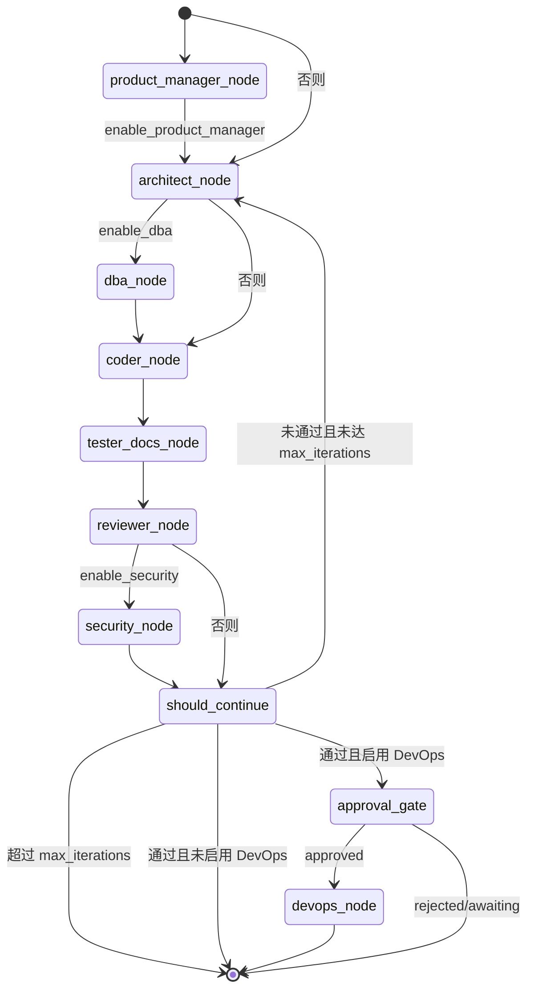
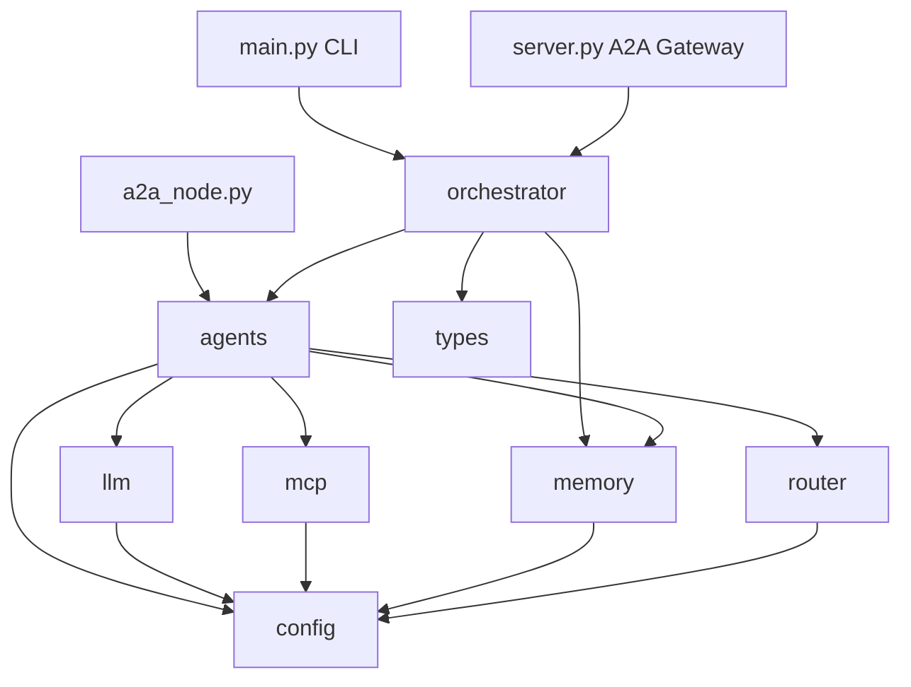
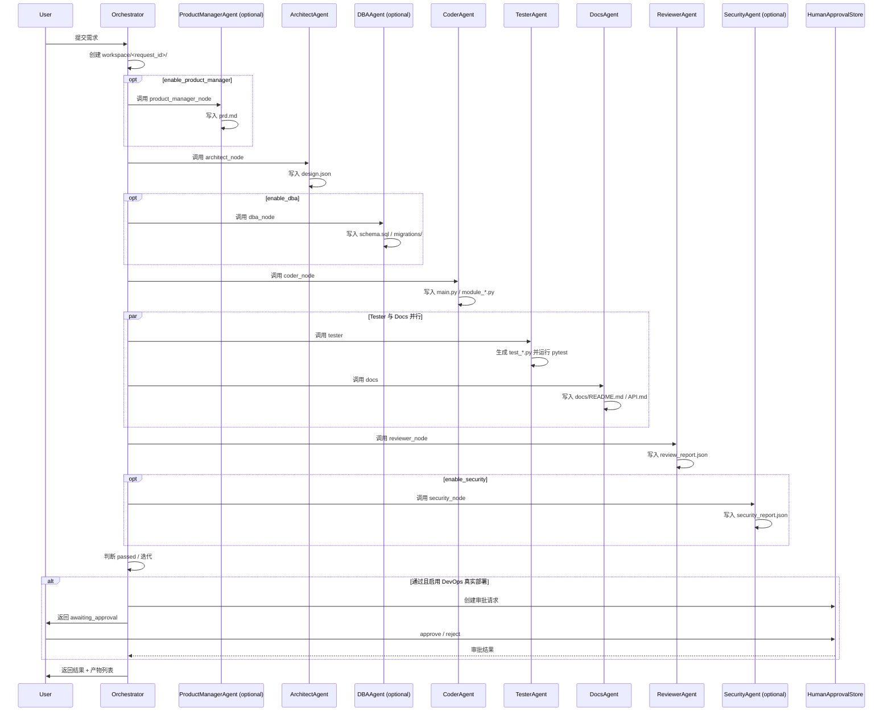

# ARCHITECTURE.md

## 1. 系统架构总览

`dev-agent-system` 是一个面向个人开发者的**多 Agent 软件工程协作系统**。核心设计目标：

- **可组合**：每个 Agent 既是独立 A2A 服务，也能被统一网关编排。
- **可追踪**：LangGraph DAG 编排所有状态转换，产物落地到 `workspace/<request_id>/`。
- **可降级**：LLM、记忆、向量检索均为可选依赖，缺失时自动降级到本地实现。
- **可校验**：LLM 输出通过 `json_mode` 强制 JSON + Pydantic `report_schema` 校验，失败时兼容旧版 Markdown。
- **可控制**：DevOps 真实部署等高风险操作受 Human-in-the-Loop（`HumanApprovalStore`）审批门约束。
- **可观测**：SSE 流式输出、结构化 JSON 报告、版本化 Prompt 与模型配置。

## 2. 核心数据流

```text
User / CLI / API
       │
       ▼
┌──────────────────────────────────────────────────────────────────────┐
│                        Orchestrator                                   │
│  LangGraph StateGraph:                                               │
│  [product_manager_node] → architect_node → [dba_node] → coder_node │
│  → {tester_node, docs_node} → reviewer_node → [security_node]      │
│  → should_continue / [devops_node / approval gate]                  │
└──────────────────────────────────────────────────────────────────────┘
       │
       ▼
┌─────────────────────────────────────────────────────────────┐
│                       A2A Agent Layer                       │
│  Architect / Coder / Tester / Reviewer / Docs / DevOps     │
│  + optional ProductManager / Security / DBA                  │
│  统一网关 server.py 或独立节点 a2a_node.py                   │
└─────────────────────────────────────────────────────────────┘
       │
       ▼
┌─────────────────────────────────────────────────────────────┐
│                    Capability Layer                         │
│  LLMClient (OpenAI / DeepSeek / Ollama / MOCK, json_mode)   │
│  ModelRouter                                                │
│  MemoryAgent (short / working / long)                       │
│  ToolSandbox (read_file / write_file / run_command)         │
│  Schemas (Pydantic report / GraphState TypedDict)           │
│  HumanApprovalStore (SQLite, optional HITL)                 │
└─────────────────────────────────────────────────────────────┘
       │
       ▼
┌─────────────────────────────────────────────────────────────┐
│                    Persistence Layer                        │
│  workspace/    ← 代码、测试、文档产物                        │
│  memory_store/ ← SQLite / ChromaDB / Redis 记忆            │
│  config/       ← model.yaml, mcp.yaml                       │
│  approvals/    ← `APPROVAL_DB` SQLite 审批状态               │
└─────────────────────────────────────────────────────────────┘
```

## 3. LangGraph DAG 状态图



## 4. 模块依赖关系



## 5. 核心模块职责

| 模块 | 路径 | 职责 |
|---|---|---|
| Orchestrator | `dev_agent_system/orchestrator.py` | LangGraph DAG 编排、迭代调度、产物汇总、Human-in-the-Loop 审批门 |
| Agents | `dev_agent_system/agents.py` | 9 个业务 Agent（含可选 ProductManager/Security/DBA），统一 `BaseAgent` 生命周期、`report_schema`、`summary_budget` |
| LLM | `dev_agent_system/llm.py` | OpenAI / DeepSeek / Ollama / MOCK 客户端，支持 `json_mode`、流式生成、PII 脱敏 |
| LLM Providers | `dev_agent_system/llm_providers.py` | 各 Provider 的 `chat`/`stream`/`astream` 实现，注入 `response_format`/`format` |
| Router | `dev_agent_system/router.py` | 按 Agent 与提示长度选择模型版本和生成参数 |
| Memory | `dev_agent_system/memory.py` | 三层记忆：short/working/long，后端可切换 SQLite/Redis/ChromaDB |
| MCP | `dev_agent_system/mcp.py` | 工具沙箱：read_file / write_file / run_command，路径隔离+白名单 |
| Config | `dev_agent_system/config.py` | `.env` + YAML 统一加载，环境变量覆盖 |
| Schemas | `dev_agent_system/schemas.py` | Pydantic 输出模型（`AgentOutput`/`AgentFile`/`DesignOutput`/...）与 `GraphState` TypedDict |
| Human Approval | `dev_agent_system/human_approval.py` | SQLite 持久化的审批状态存储（`pending/approved/rejected`） |
| Server | `dev_agent_system/server.py` | 统一 FastAPI A2A 网关，含 `/orchestrate/stream` SSE 与审批端点 |
| A2A Node | `dev_agent_system/a2a_node.py` | 独立启动单个 Agent 的 FastAPI 服务 |

## 6. 状态与产物流转



## 7. 安全边界

- **沙箱路径隔离**：所有 `write_file` / `read_file` 必须落在 `workspace/` 内。
- **命令白名单**：仅允许 `python`、`pytest`、`git`、`ls`、`cat`、`echo`、`docker build` 及 Java/Go/TS 工具链开头命令。
- **命令黑名单**：正则拦截 `rm -rf`、`curl | sh`、`wget -O-` 等危险模式。
- **PII 脱敏**：`LLMClient._mask` 在调用 LLM 前移除 API Key、手机号、密码。
- **HITL 原则**：DevOps 真实部署（`DEVOPS_DRY_RUN=false`）等高风险操作默认要求人工确认。
- **审批持久化**：`HumanApprovalStore` 将 `pending/approved/rejected` 状态持久化到 SQLite，Server 提供 `/tasks/{id}/approval`、`/approve`、`/reject` 端点。

## 8. 扩展点

- 新增 Agent：继承 `BaseAgent`，实现 `build_prompt` 与 `postprocess`。
- 新增工具：在 `MCPToolRegistry.register` 中注册，或在 `ToolSandbox` 中新增类方法。
- 新增记忆后端：实现 `MemoryBackend` 协议，在 `_create_backend` 中注册。
- 新增模型路由策略：扩展 `ModelRouter.resolve` 的复杂度判定逻辑。

## 9. 部署形态

| 形态 | 入口 | 说明 |
|---|---|---|
| CLI | `python -m dev_agent_system.main "需求"` | 本地单次执行 |
| 统一网关 | `python -m dev_agent_system.server --port 8000` | 多 Agent 合一，含 SSE 流式与审批端点 |
| 独立节点 | `python -m dev_agent_system.a2a_node --agent coder --port 8082` | A2A 微服务 |
| 集群 | `python scripts/run_a2a_cluster.py` | 同时启动 6 个核心节点（可按需扩展） |
| Docker | `docker-compose up --build -d` | 容器化部署 |
