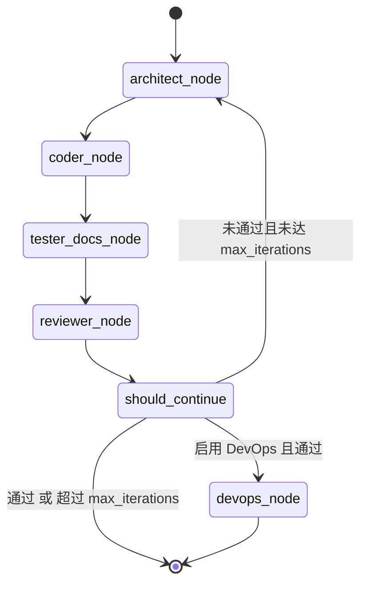
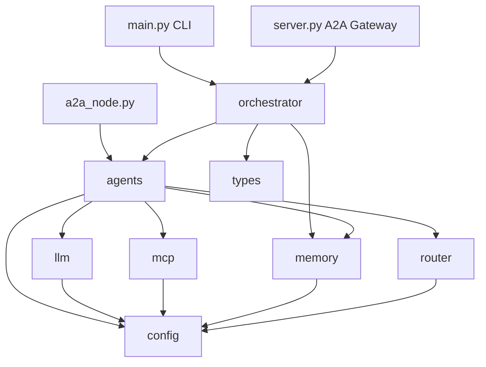
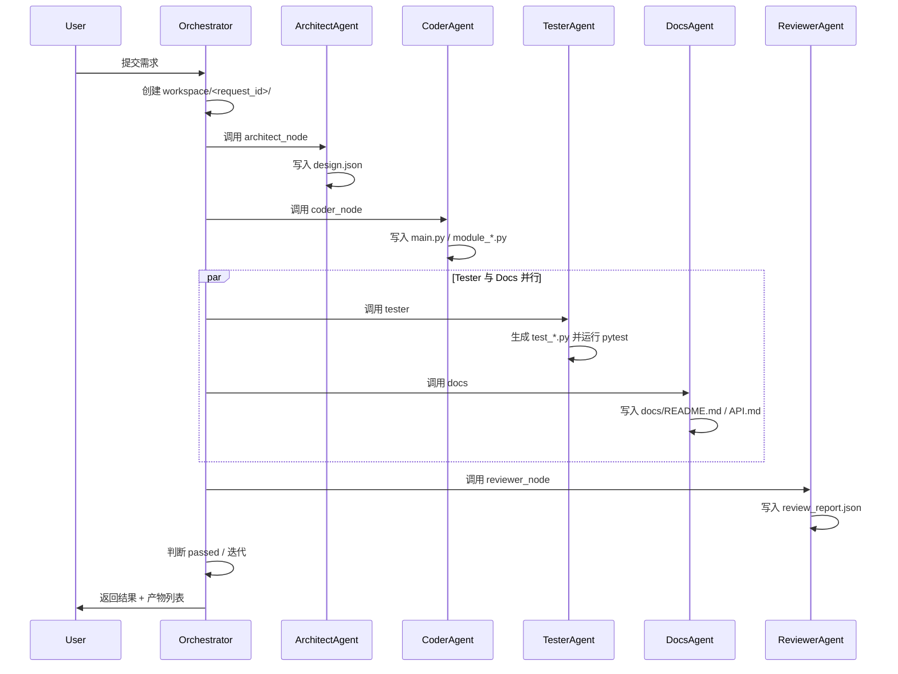

# ARCHITECTURE.md

## 1. 系统架构总览

`dev-agent-system` 是一个面向个人开发者的**多 Agent 软件工程协作系统**。核心设计目标：

- **可组合**：每个 Agent 既是独立 A2A 服务，也能被统一网关编排。
- **可追踪**：LangGraph DAG 编排所有状态转换，产物落地到 `workspace/<request_id>/`。
- **可降级**：LLM、记忆、向量检索均为可选依赖，缺失时自动降级到本地实现。
- **可观测**：SSE 流式输出、结构化 JSON 报告、版本化 Prompt 与模型配置。

## 2. 核心数据流

```text
User / CLI / API
       │
       ▼
┌─────────────────────────────────────────────────────────────┐
│                        Orchestrator                          │
│  LangGraph StateGraph:                                      │
│  architect_node → coder_node → {tester_node, docs_node}     │
│                                    → reviewer_node → loop   │
└─────────────────────────────────────────────────────────────┘
       │
       ▼
┌─────────────────────────────────────────────────────────────┐
│                       A2A Agent Layer                       │
│  Architect / Coder / Tester / Reviewer / Docs / DevOps     │
│  统一网关 server.py 或独立节点 a2a_node.py                   │
└─────────────────────────────────────────────────────────────┘
       │
       ▼
┌─────────────────────────────────────────────────────────────┐
│                    Capability Layer                         │
│  LLMClient (OpenAI / 流式 / MOCK)  → ModelRouter            │
│  MemoryAgent (short / working / long)                         │
│  ToolSandbox (read_file / write_file / run_command)          │
└─────────────────────────────────────────────────────────────┘
       │
       ▼
┌─────────────────────────────────────────────────────────────┐
│                    Persistence Layer                        │
│  workspace/    ← 代码、测试、文档产物                        │
│  memory_store/ ← SQLite / ChromaDB / Redis 记忆               │
│  config/       ← model.yaml, mcp.yaml                       │
└─────────────────────────────────────────────────────────────┘
```

## 3. LangGraph DAG 状态图



## 4. 模块依赖关系



## 5. 核心模块职责

| 模块 | 路径 | 职责 |
|---|---|---|
| Orchestrator | `dev_agent_system/orchestrator.py` | LangGraph DAG 编排、迭代调度、产物汇总 |
| Agents | `dev_agent_system/agents.py` | 6 个业务 Agent + Memory Facade，统一 `BaseAgent` 生命周期 |
| LLM | `dev_agent_system/llm.py` | OpenAI 兼容客户端、流式生成、MOCK 降级、PII 脱敏 |
| Router | `dev_agent_system/router.py` | 按 Agent 与提示长度选择模型版本和生成参数 |
| Memory | `dev_agent_system/memory.py` | 三层记忆：short/working/long，后端可切换 SQLite/Redis/ChromaDB |
| MCP | `dev_agent_system/mcp.py` | 工具沙箱：read_file / write_file / run_command，路径隔离+白名单 |
| Config | `dev_agent_system/config.py` | `.env` + YAML 统一加载，环境变量覆盖 |
| Types | `dev_agent_system/types.py` | Pydantic 模型与 `GraphState` TypedDict |
| Server | `dev_agent_system/server.py` | 统一 FastAPI A2A 网关，含 `/orchestrate/stream` SSE |
| A2A Node | `dev_agent_system/a2a_node.py` | 独立启动单个 Agent 的 FastAPI 服务 |

## 6. 状态与产物流转



## 7. 安全边界

- **沙箱路径隔离**：所有 `write_file` / `read_file` 必须落在 `workspace/` 内。
- **命令白名单**：仅允许 `python`、`pytest`、`git`、`ls`、`cat`、`echo`、`docker build` 开头命令。
- **命令黑名单**：正则拦截 `rm -rf`、`curl | sh`、`wget -O-` 等危险模式。
- **PII 脱敏**：`LLMClient._mask` 在调用 LLM 前移除 API Key、手机号、密码。
- **HITL 原则**：DevOps 部署等高风险操作默认要求人工确认。

## 8. 扩展点

- 新增 Agent：继承 `BaseAgent`，实现 `build_prompt` 与 `postprocess`。
- 新增工具：在 `MCPToolRegistry.register` 中注册，或在 `ToolSandbox` 中新增类方法。
- 新增记忆后端：实现 `MemoryBackend` 协议，在 `_create_backend` 中注册。
- 新增模型路由策略：扩展 `ModelRouter.resolve` 的复杂度判定逻辑。

## 9. 部署形态

| 形态 | 入口 | 说明 |
|---|---|---|
| CLI | `python -m dev_agent_system.main "需求"` | 本地单次执行 |
| 统一网关 | `python -m dev_agent_system.server --port 8000` | 6 Agent 合一，含 SSE 流式 |
| 独立节点 | `python -m dev_agent_system.a2a_node --agent coder --port 8082` | A2A 微服务 |
| 集群 | `python scripts/run_a2a_cluster.py` | 同时启动 6 个节点 |
| Docker | `docker-compose up --build -d` | 容器化部署 |
